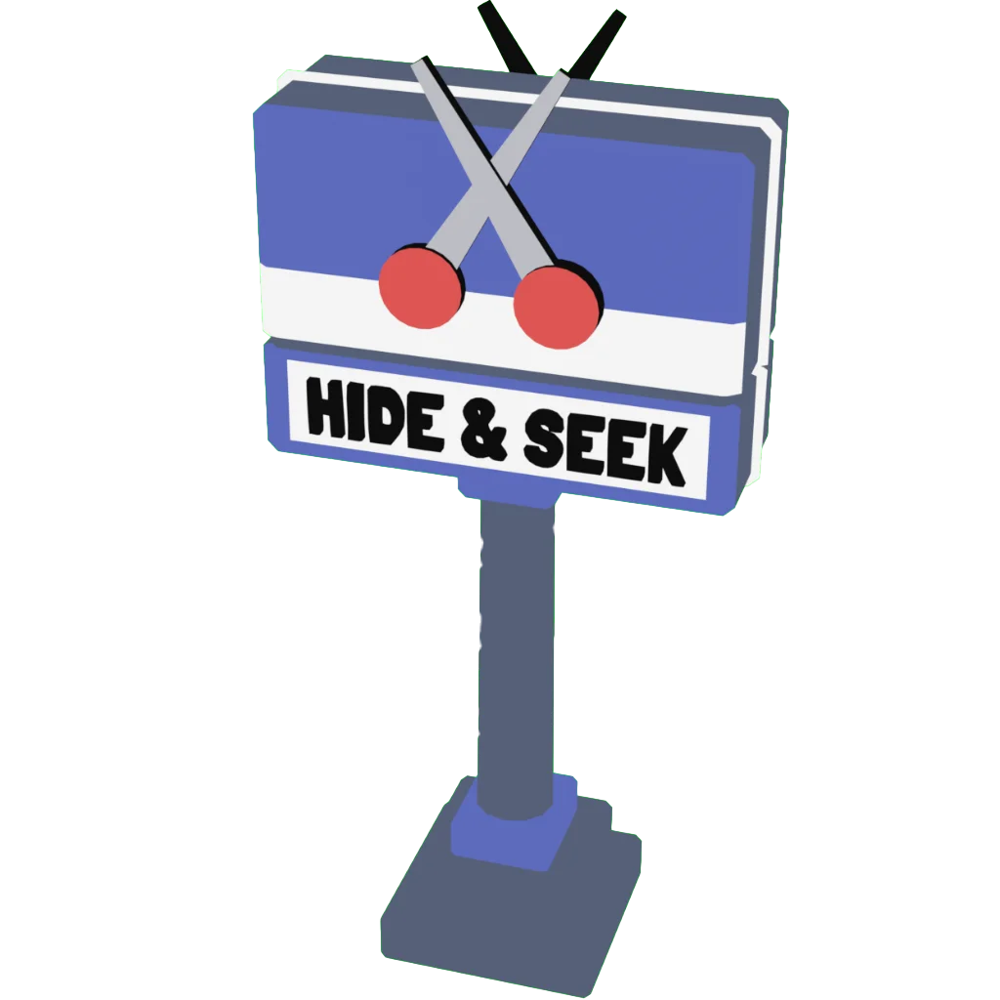
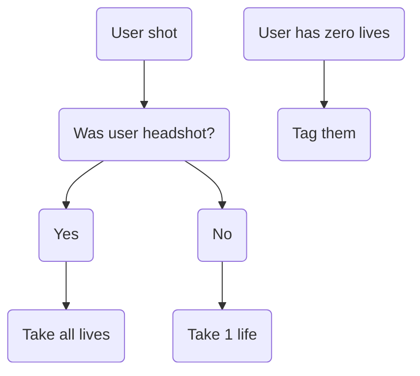

---
hide:
- toc
description: The Hide & Seek mode in Yeeps
---

# Hide & Seek

The Hide & Seek mode is the only mode that doesn't need a sign. This sign is optional and was only added in the Research Facility aka Wiring update as a decoration and to catch game events for the Hide & Seek gamemode.
## How to Play
In Hide & Seek, a random person in the lobby is chosen as the first seeker when the game starts. The Seekers get a red glow. The hiders do not and have to hide.
For a Seeker to tag someone, they must throw a pin at them. [^1]
## Yeeps 2.0
In [Yeeps 2.0](../releaseNotes/2.0.md), the mechanics of Hide & Seek were modified.
Before, hitting a player with a pin instantly tagged them.
It was changed so that Hiders have 3 lives.
A headshot takes all 3.
Any other takes 1.
Losing all your lives makes you a Seeker.
Here's a graph to help you understand:

[^1]: Reminder that Yeeps is a VR GAME. DO NOT ACTUALLY TRY TO TAG SOMEONE IN REAL LIFE. *If* you do regardless, and someone gets hurt, Trass Games and the Yeeps Wiki team ARE NOT LIABLE.
